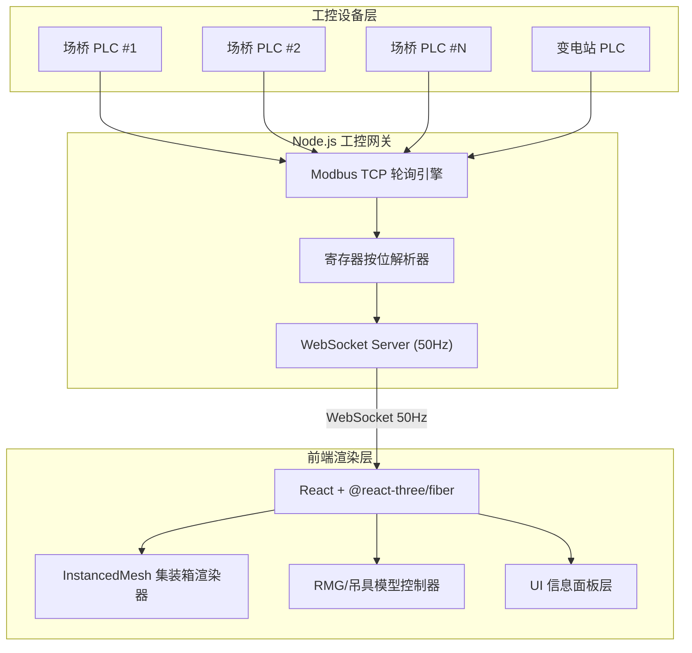
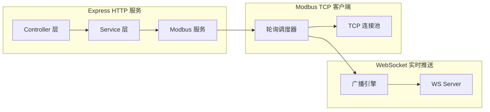
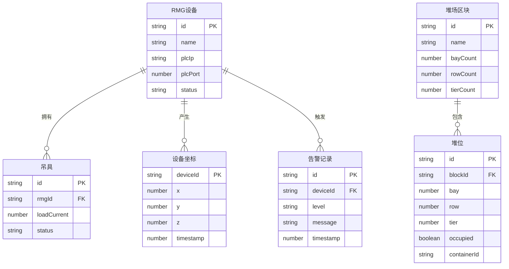

## 1. 架构设计



## 2. 技术说明

- **前端**：React@18 + @react-three/fiber@8 + @react-three/drei@9 + @react-three/postprocessing + three@0.169 + tailwindcss@3 + zustand@4 + vite
- **后端**：Express@4 + modbus-serial（Modbus TCP 客户端）+ ws（WebSocket 服务器）
- **初始化工具**：vite-init（react-express-ts 模板）
- **数据库**：无持久化数据库，纯实时数据流架构（PLC → 网关 → 前端），历史数据可用内存环形缓冲区暂存

### 关键依赖

| 包名 | 用途 |
|------|------|
| three | Three.js 3D 渲染核心 |
| @react-three/fiber | React 绑定 Three.js |
| @react-three/drei | Three.js 常用辅助组件 |
| @react-three/postprocessing | 后处理效果（Bloom/SSAO） |
| modbus-serial | Modbus TCP 客户端通信 |
| ws | WebSocket 服务器 |
| zustand | 前端状态管理 |
| tailwindcss | 样式系统 |

## 3. 路由定义

| 路由 | 用途 |
|------|------|
| / | 三维堆场全景大屏（默认主页） |
| /monitor | 设备实时监控面板 |
| /dispatch | 数据驱动调度中心 |

## 4. API 定义

### 4.1 WebSocket 数据帧格式

```typescript
interface PLCDataFrame {
  timestamp: number;
  rmgDevices: RMGDeviceState[];
  containers: ContainerState[];
  alarms: AlarmEvent[];
}

interface RMGDeviceState {
  id: string;
  position: { x: number; y: number; z: number };
  spreader: {
    position: { x: number; y: number; z: number };
    loadCurrent: number;
    status: 'idle' | 'moving' | 'lifting' | 'fault';
  };
  motorCurrent: number;
  speed: number;
  status: 'online' | 'offline' | 'fault';
}

interface ContainerState {
  bay: number;
  row: number;
  tier: number;
  occupied: boolean;
  containerId?: string;
  size?: '20ft' | '40ft' | '45ft';
}

interface AlarmEvent {
  id: string;
  deviceId: string;
  level: 'critical' | 'warning' | 'info';
  message: string;
  timestamp: number;
}
```

### 4.2 REST API

| 方法 | 路径 | 描述 |
|------|------|------|
| GET | /api/health | 网关健康检查 |
| GET | /api/devices | 获取设备列表及状态快照 |
| GET | /api/alarms | 获取告警历史 |
| GET | /api/yard/stats | 获取堆场利用率统计 |
| GET | /api/yard/layout | 获取堆场布局配置 |

### 4.3 REST API 类型定义

```typescript
interface HealthResponse {
  status: 'ok' | 'degraded' | 'error';
  modbusConnections: { ip: string; connected: boolean }[];
  wsClients: number;
  uptime: number;
}

interface DeviceListResponse {
  devices: {
    id: string;
    type: 'rmg' | 'rtg' | 'reachstacker';
    status: 'online' | 'offline' | 'fault';
    lastUpdate: number;
  }[];
}

interface AlarmHistoryResponse {
  alarms: AlarmEvent[];
  total: number;
}

interface YardStatsResponse {
  totalSlots: number;
  occupiedSlots: number;
  utilizationRate: number;
  blocks: {
    id: string;
    utilizationRate: number;
    bayCount: number;
    maxTier: number;
  }[];
}

interface YardLayoutResponse {
  origin: { x: number; y: number; z: number };
  blocks: {
    id: string;
    bays: number;
    rows: number;
    tiers: number;
    baySpacing: number;
    rowSpacing: number;
    tierHeight: number;
  }[];
}
```

## 5. 服务器架构图



## 6. 数据模型

### 6.1 数据模型定义



### 6.2 数据定义语言

由于本项目采用纯实时数据流架构，不使用关系型数据库。数据通过以下方式管理：

- **PLC 寄存器映射表**：硬编码配置在 Node.js 网关中，定义每个 PLC IP 地址对应的寄存器地址与解析规则
- **堆场布局配置**：JSON 配置文件定义堆场区块、行列层参数和空间间距
- **环形缓冲区**：内存中维护最近 N 帧数据用于历史趋势图展示

```sql
-- 堆场布局配置参考（实际使用 JSON 文件）
-- Block: id, name, bayCount, rowCount, tierCount, baySpacing, rowSpacing, tierHeight
-- ContainerSlot: blockId, bay, row, tier, occupied, containerId, size
-- RMGDevice: id, name, plcIp, plcPort, status
-- AlarmLog: id, deviceId, level, message, timestamp
```
